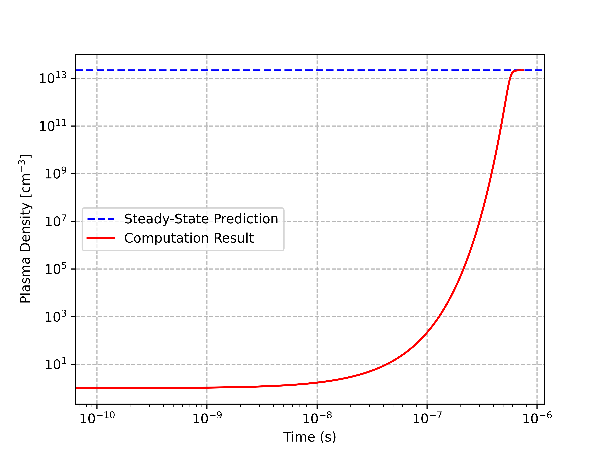

Simple Two-Reaction Argon Plasma
================================

Problem Description
-------------------

Here, we consider a simple argon plasma composed of electrons, atomic ions, and the background gas.
The source of ions and electrons is electron-impact ionization, and the sink is three-body recombination:

.. math::
    :label: two_reaction_mechanism

    \text{e} + \text{Ar} \to \text{e} + \text{e} + \text{Ar}^{+} 

    \text{e} + \text{Ar}^{+} + \text{Ar} \to \text{Ar} + \text{Ar} 

The electron Boltzmann equation solver (EBE) `LoKI-B <https://github.com/IST-Lisbon/LoKI>`_ is used to solve for the rate coefficient of ionization. 
The recombination rate coefficient is assumed to be constant at :math:`k = 10^{-25} \; \text{cm}^6/\text{s}`. 
The background gas density starts at :math:`n_{Ar}(t=0) = 2.5 \times 10^{19} \; \text{cm}^{-3}` or 1 atm/760 torr at 295 K. 
The ions and electrons start at an equal density of :math:`n_{e,i}(t=0) = 1 \; \text{cm}^{-3}`.
The reduced electric field :math:`E/N` is kept fixed at 30 Td.

Theory
------

For each our three species under consideration, we can write an ordinary differential equation that describes the change in density due to the chemical reactions:

.. math::
    :label: ODE_system

    \frac{d n_e}{d t} = k_i n_e n_{Ar} - k_r n_e n_i n_{Ar},

    \frac{d n_i}{d t} = k_i n_e n_{Ar} - k_r n_e n_i n_{Ar},
    
    \frac{d n_{Ar}}{d t} = - k_i n_e n_{Ar} + k_r n_e n_i n_{Ar},

where :math:`n_e`, :math:`n_i`, :math:`n_{Ar}` are the number densities (:math:`\text{cm}^{-3}`) of the electrons, ions, and neutral gas, respectively, 
and :math:`k_i` (:math:`\text{cm}^3/\text{s}`) and :math:`k_r` (:math:`\text{cm}^6/\text{s}`) are the rate coefficients of ionization and recombination. 
It is immediately noticable that the equations describing the chemical kinetics of the electrons and the ions are identical. 
When combined with enforcing identical initial conditions on the two species, this ensures that the quasineutrality of the plasma is maintained, i.e. :math:`n_e = n_i`.

As part of the verification of this model, we can predict the steady-state plasma density :math:`n_p = n_e = n_i` 
by setting the first (or second) equation from the set above to zero, and solving for :math:`n_p`:

.. math::
    :label: ODE_system

    \frac{d n_p}{d t} = k_i n_p n_{Ar} - k_r n_p n_p n_{Ar} = 0 \Rightarrow n_p = \frac{k_i}{k_r}.

In order to calculate the value of :math:`k_i`, we can either 1) solve the EBE or 
2) integrate the ionization cross-section over an assumed electron energy distribution function (EEDF), such as a Maxwellian.
We opt for the former as this is what we will use going forward in other tutorials. 

Preprocessing: Calculation of Rate Coefficients with LoKI-B
-----------------------------------------------------------

In this section, we solve the EBE and obtain tabulated rate coefficients of electron-impact processes versus the reduced electric field, :math:`E/N`. 
Our computational tool of choice is `LoKI-B <https://github.com/IST-Lisbon/LoKI>`_, which requires MATLAB. 
If you do not have access to MATLAB, you can use `BOLSIG+ <https://nl.lxcat.net/solvers/BolsigPlus/index.php>`_, but the proper use of BOLSIG+ will not discussed here.

The first step is to a .txt file containing the tabulated electorn-impact cross sections of interest. 
Here, we use the `Morgan database for Ar from LXCat < www.lxcat.net/Morgan>`_. 
Within the directory ``crane/tutorials/TwoReactionArgon/data``, the file ``Ar_Morgan.txt`` is a modified version of the .txt file obtained from LxCat such that:
1) only the metastable excitation pathway is included (i.e. we exclude the "total excitation" process) and is renamed from Ar* to Ar(eff),
2) the first comment of each process describes the reaction from the ground state Ar(1S0), which is parsed by LoKI-B.

Second, a LoKI-B input file can be written to solve for the EBE with the provided cross sections and operating conditions. 
The input file ``Ar_lumped.in`` that was used for this tutorial can be found in ``crane/tutorials/TwoReactionArgon/data``. 
Both ``Ar_lumped.in`` and ``Ar_Morgan.txt`` can be placed in ``LoKI/Code/Input/Argon``, 
and running the command ``lokibcl('Argon/Argon_lumped.in')`` while in ``LoKI/Code`` will execute the input file.

After the input file is executed, a new directory ``LoKI/Output/ArLumped`` will be generated which includes the ``lookUpTableRateCoeff.txt``.
This file contains the rate coefficients in :math:`\text{m}^3/\text{s}` for each process versus the reduced electric field in Td. 
To tabulate the ionization rate coefficient in a CRANE-acceptable format, a simple Python script can be written:

.. literalinclude:: ../../tutorials/TwoReactionArgon/data/RateCoeffReader.py
   :language: python
   :lines: 1-

This writes a new file called ``ionization.txt`` where the reduced electric field in Td is to the left 
and the corresponding rate coefficient in :math:`\text{cm}^3/\text{s}` is the right.
With all the preprocessing complete, we are ready to build our CRANE input file!

WARNING: In this example, we are only interested in obtaining the ionization rate coefficient from LoKI-B. 
However, this DOES NOT mean the ionization cross section should be the only one tabulated. 
The other cross sections, especially elastic scattering, are absolutely necessary to accurately reflect the relaxation of the electrons.

CRANE Input File & Running
--------------------------

The input file ``TwoReactionArgon.i`` in ``crane/tutorials/TwoReactionArgon`` is shown below:

.. literalinclude:: ../../tutorials/TwoReactionArgon/TwoReactionArgon.i
   :language: toml
   :lines: 1-

The input file can be excuted by

.. code-block:: bash 

    $ ../../crane-opt -i TwoReactionArgon.i

Postprocessing: Visualizing the Plasma Density
----------------------------------------------

After the input file is excuted, the file ``TwoReactionArgon_out.csv`` is generated, which tabulates the value of each variable including rate coefficients for each timestep.
We can use a simple Python script ``plasma_density_plot.py`` to plot :math:`n_e(t)` along with the steady-state prediction as solved in the Theory section.

.. literalinclude:: ../../tutorials/TwoReactionArgon/plasma_density_plot.py
   :language: python
   :lines: 1-

Indeed, the plasma density reaches the predicted steady-state value:

