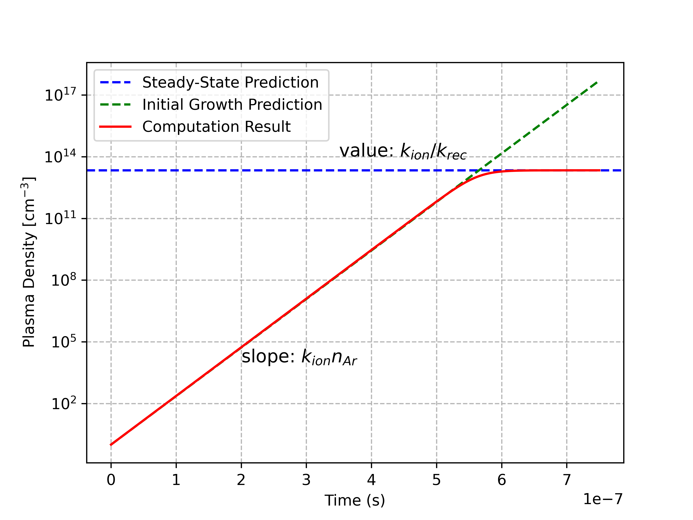

Two-Reaction Argon Plasma
==========================

Problem Description
-------------------

Here, we consider a simple argon plasma composed of only three species, 
electrons (:math:`\text{e}`), argon ions (:math:`\text{Ar}^{+}`), 
and argon neutrals (:math:`\text{Ar}`). The three species interact
through two reactions:

.. math::
    :label: two_reaction_mechanism

    \text{e} + \text{Ar} \to \text{e} + \text{e} + \text{Ar}^{+} 

    \text{e} + \text{Ar}^{+} + \text{Ar} \to \text{Ar} + \text{Ar} 

where the first reaction is ionization and the second reaction is
recombination. The rate coefficients of these reactions are denoted
:math:`k_i` and :math:`k_r`, respectively.

The goal of this tutorial is to demonstrate how to use CRANE to solve for the
time evolution of the plasma density and compare the results
to the expected analytical steady-state value, :math:`n_p = k_i / k_r`.

We will also use this tutorial to demonstrate how to pre-process the rate
coefficients of the two reactions in the system and how to use tabulated
rate coefficients in CRANE. The pre-processing of the rate coefficients is
performed using the `LoKI-B <https://github.com/IST-Lisbon/LoKI>`_ code
from the IST-Lisbon group.

The tutorial is organized as follows:

1. We first solve the electron Boltzmann equation (EBE) to obtain the ionization rate
   coefficient :math:`k_i` as a function of the reduced electric field :math:`E/N`.

2. We then use CRANE to solve the system of ordinary differential equations 
   (ODEs) that describe the time evolution of the density of each species. 

3. Finally, we compare the steady-state plasma density :math:`n_p` obtained from 
   CRANE to the analytical value :math:`n_p = k_i / k_r`.

Theory
------

For each our three species under consideration (:math:`\text{e}`, 
:math:`\text{Ar}^{+}`, :math:`\text{Ar}`), we can write an ordinary differential 
equation that describes the change in density due to the plasma-chemical reactions:

.. math::
    :label: ODE_system

    \frac{d n_e}{d t} = k_i n_e n_{Ar} - k_r n_e n_i n_{Ar},

    \frac{d n_i}{d t} = k_i n_e n_{Ar} - k_r n_e n_i n_{Ar},
    
    \frac{d n_{Ar}}{d t} = - k_i n_e n_{Ar} + k_r n_e n_i n_{Ar},

where :math:`n_e`, :math:`n_i`, :math:`n_{Ar}` are the number densities 
(:math:`\text{cm}^{-3}`) of the electrons, ions, and neutral gas, respectively, 
and :math:`k_i` (:math:`\text{cm}^3/\text{s}`) and :math:`k_r` (:math:`\text{cm}^6/\text{s}`) 
are the rate coefficients of ionization and recombination. 
It is immediately noticable that the equations describing the chemical kinetics 
of the electrons and the ions are identical. 
When combined with the enforcing of identical initial conditions on the two species, 
this ensures that the quasineutrality of the plasma is maintained, i.e. :math:`n_e = n_i`.

As part of the verification of this model, we can predict the steady-state 
plasma density :math:`n_p = n_e = n_i` by setting the first (or second) equation 
from the set above to zero, and solving for :math:`n_p`

.. math::
    :label: tworeaction_equilibrium_density

    \frac{d n_p}{d t} = k_i n_p n_{Ar} - k_r n_p n_p n_{Ar} = 0 \Rightarrow n_p = \frac{k_i}{k_r}.

The equilibrium plasma density :math:`n_p` is determined by the ratio of
the ionization and recombination rate coefficients, :math:`k_i` and :math:`k_r` 
respectively. This result will be used to verify the results obtained from CRANE.

Additionally, we can predict the initial trend of the plasma-density growth.
At early times, :math:`n_p` is small (near its initial condition of 1), 
so the reaction rate of ionization is much greater than the reaction rate of recombination.
As a result, at early times,

.. math::
    :label: tworeaction_early_analysis

    \frac{d n_p}{d t} \simeq k_i n_p n_{Ar} \Rightarrow n_p(t) = n_{p0} \exp(k_i n_{Ar} t),

where :math:`n_{p0} = 1 \; \text{cm}^{-3}` is the initial plasma density. 
We expect that the plasma density will grow as predicted by this equation
until it is sufficiently high such that recombination eventually brings the density to 
a steady-state value.

Simulation Conditions 
---------------------

The neutral argon gas is initially at atmospheric pressure, 
:math:`p_{Ar}` = 1 atm = 760 torr and room temperature, 
:math:`T_{Ar}` = 295 K. The corresponding neutral gas density is
obtained from the ideal gas law, :math:`n_{Ar} = p_{Ar}/(k_B T_{Ar})`, 
where :math:`k_B` is the Boltzmann constant, which gives an initial 
neutral gas density of :math:`n_{Ar} = 2.5 \times 10^{19} \; \text{cm}^{-3}`. 
Conversely, the ions and electrons start from a very low initial density of 
:math:`n_{e,i}(t=0) = 1 \; \text{cm}^{-3}`. A reduced electric field :math:`E/N = 30` Td is 
kept constant throughout the simulation to achieve breakdown and sustain the plasma to steady-state. 

In order to calculate the value of the ionization rate coefficient :math:`k_i`, 
we can either (1) solve the EBE or (2) integrate the ionization cross-section over an assumed 
electron energy distribution function (EEDF), such as a Maxwellian.
We opt for the former as this is the most common practice, 
which we will use going forward also in other tutorials. On the other hand,
the recombination rate coefficient :math:`k_r` of the second reaction 
is assumed to be constant with a value of :math:`k_r = 10^{-25} \; \text{cm}^6/\text{s}`. 

For the solution of the electron Boltzmann equation (EBE), we use the
solver `LoKI-B <https://github.com/IST-Lisbon/LoKI>`_ to obtain the
rate coefficient :math:`k_i` as a function of the reduced electric field
:math:`E/N`. The EBE is solved for a range of :math:`E/N` values from 0.001 to 1000 Td.
The resulting rate coefficients are then tabulated by LoKI-B, 
and we pre-process these into a CRANE-acceptable format. 

Summarizing the simulation conditions in a table:

+---------------------+-------------------+ 
| Parameter           | Value             |
+=====================+===================+
| Initial Ar density  | 2.5e19 cm^-3      |
+---------------------+-------------------+ 
| Initial e density   | 1 cm^-3           | 
+---------------------+-------------------+ 
| Initial i density   | 1 cm^-3           |
+---------------------+-------------------+ 
| Reduced field E/N   | 30 Td             | 
+---------------------+-------------------+ 
| Ionization from EEDF| 2.17e-12 cm^3/s   | 
+---------------------+-------------------+ 
| Recombination k_r   | 1e-25 cm^6/s      | 
+---------------------+-------------------+ 

Find the Ionization Rate Coefficient using LoKI-B
---------------------------------------------------

In this section, we solve the EBE and obtain the ionization rate coefficient
:math:`k_i` as a function of the reduced electric field :math:`E/N`.
The EBE is solved for a range of :math:`E/N` values from 0.001 to 1000 Td.
The resulting rate coefficients are then tabulated by LoKI-B, 
and we pre-process these into a CRANE-acceptable format. 

Our computational tool of choice is `LoKI-B <https://github.com/IST-Lisbon/LoKI>`_, 
which requires MATLAB. If you do not have access to MATLAB, you can use 
`BOLSIG+ <https://nl.lxcat.net/solvers/BolsigPlus/index.php>`_. 
The proper usage of LoKI-B or BOLSIG+ is not discussed here.

Cross Sections from LxCat
^^^^^^^^^^^^^^^^^^^^^^^^^

The first step is to save the electron-impact cross-sections of interest in a
tabulated format. The cross-sections can be obtained from the online `LXCat database
<https://www.lxcat.net>`_. The LXCat database contains a large number of
electron-impact cross-sections for a wide range of species. The cross-sections
are tabulated in a ``.txt`` file, which can be downloaded from the LXCat website.

The ``.txt`` LXCat file contains a header with information about the cross-sections,
and the cross-sections of each process are tabulated separately. 
Each table contains the cross-section :math:`\sigma` (:math:`\text{m}^2`) in the second column
as a function of electron energy :math:`\varepsilon` (:math:`eV`) in the first column for the given process.
For our simple problem, we nominally need just the ionization cross-section. 
However, we will also include the metastable excitation cross-section,
and importantly, the elastic momentum transfer cross-section.
The elastic momentum transfer cross-section is needed to calculate the
electron energy loss rate, and therfore, necessary to obtain an accurate EEDF.

LxCat has multiple databases for Ar. Here, we use the 
`Morgan database <https://www.lxcat.net/Morgan>`_. 
From the Morgan database, we select cross-sections for the following processes:

* ``e + Ar -> e + Ar``: elastic momentum transfer
* ``e + Ar -> e + Ar*``: metastable excitation
* ``e + Ar -> e + e + Ar+``: ionization
  
The cross-sections are tabulated in a ``.txt`` file, which can be downloaded
from the LxCat website. We have saved the ``.txt`` file in the directory
``crane/tutorials/TwoReactionArgon/data`` as ``Ar_Morgan.txt``. 
The file is modified such that: (a) only the metastable
excitation pathway is included (i.e. we exclude the "total excitation"
process), (b) Ar* is renamed to Ar(eff), and (c) the first comment of each
process describes the reaction from the ground state Ar(1S0), which is parsed
by LoKI-B.

.. literalinclude:: ../../tutorials/TwoReactionArgon/data/Ar_Morgan.txt
   :language: text
   :lines: 50-65
   :caption: Ar_Morgan.txt (lines 50-65)

.. literalinclude:: ../../tutorials/TwoReactionArgon/data/Ar_Morgan.txt
   :language: text
   :lines: 124-138
   :caption: Ar_Morgan.txt (lines 124-138)

.. literalinclude:: ../../tutorials/TwoReactionArgon/data/Ar_Morgan.txt
   :language: text
   :lines: 155-168
   :caption: Ar_Morgan.txt (lines 155-168)

.. warning:: 

    In this example, we are only interested in obtaining 
    the ionization rate coefficient from LoKI-B. However, this DOES NOT 
    mean the ionization cross section should be the only one tabulated. 
    The other cross sections, especially elastic scattering, are absolutely
    necessary to accurately reflect the relaxation of the electrons.

Using LoKI-B to Calculate the Ionization Rate Coefficient
^^^^^^^^^^^^^^^^^^^^^^^^^^^^^^^^^^^^^^^^^^^^^^^^^^^^^^^^^

In this section, we set up a LoKI-B input file named ``Ar_lumped.in``
that provides the necessary information of operating conditions and cross-sections
to solve the EBE and obtain the ionization rate coefficient using LoKI-B. 
This LoKI-B input file ``Ar_lumped.in`` that was used for this tutorial can be found in 
``crane/tutorials/TwoReactionArgon/data/Ar_lumped.in``. 
Please note that CRANE does not read or write this file in any way;
``Ar_lumped.in`` must be copied into an appropriate location with LoKI-B, 
an external software to CRANE. 

The input file is reported below. For an explanation on the functionality 
and use of each of the working conditions, electron kinetics configurations, outputs, etc., 
please refer to the LoKI-B documentation. However, a brief explanation can be provided. 
As shown, we have set the range of reduced electric field values to 0.001 to 1000,
the excitation frequency is set to 0 for a direct-current field,
the gas pressure is 101325 Pa = 1 atm, the gas temperature is 295 K, 
the electron kinetics calculation is set up to solve the electron Boltzmann equation, 
the input file points to the ``Ar_Morgan.txt`` file that contains the desired cross-sections,
the population of the gases and states is listed, and after execution, the program outputs various 
data files, including the rate coefficients for each process.

.. literalinclude:: ../../tutorials/TwoReactionArgon/data/Ar_lumped.in
   :language: matlab  
   :lines: 1-
   :caption: Ar_lumped.in

Place both ``Ar_lumped.in`` and the cross section file ``Ar_Morgan.txt`` 
in the directory ``LoKI/Code/Input/Argon``, and run LoKI-B in MATLAB with the command 

.. code:: matlab 
    
   >> lokibcl('Argon/Argon_lumped.in')

while in ``LoKI/Code`` to execute the input file.

After the input file is executed, a new directory ``LoKI/Output/ArLumped`` is generated 
which includes the output lookup table ``lookUpTableRateCoeff.txt``.
This file contains the rate coefficients in units of :math:`\text{m}^3/\text{s}` 
for each process versus the reduced electric field in Td.

.. literalinclude:: ../../tutorials/TwoReactionArgon/data/lookUpTableRateCoeff.txt
   :language: python  
   :lines: 1-16
   :caption: lookUpTableRateCoeff.txt (lines 1-16)

Tabulate the Ionization Rate Coefficient in CRANE Format
^^^^^^^^^^^^^^^^^^^^^^^^^^^^^^^^^^^^^^^^^^^^^^^^^^^^^^^^

To tabulate the ionization rate coefficient in a CRANE-acceptable format,
the following Python script is a suitable example:

.. literalinclude:: ../../tutorials/TwoReactionArgon/data/RateCoeffReader.py
   :language: python
   :lines: 1-
   :caption: RateCoeffReader.py

This writes a new two-column file ``ionization.txt``, parsable by CRANE,
where the first column is the reduced electric field in Td, and the second column
is the ionization rate coefficient in :math:`\text{cm}^3/\text{s}`. 

.. literalinclude:: ../../tutorials/TwoReactionArgon/data/ionization.txt
   :lines: 56-66
   :caption: ionization.txt (lines 56-66)

Now that we have found the ionization rate coefficient and saved it in a file, 
we are ready to build the CRANE input file for our problem. 

Input File
-----------

The input file ``TwoReactionArgon.i`` in ``crane/tutorials/TwoReactionArgon``
is shown, block-by-block, with an accompanying explanation.

Mesh
^^^^

.. literalinclude:: ../../tutorials/TwoReactionArgon/TwoReactionArgon.i
   :language: toml
   :lines: 1-7

Because we are uninterested in transport and want to capture the "volume-averaged"
plasma-chemical kinetics of this two-reaction system, 
a single mesh element of arbitrary length is necessary and sufficient.

Variables and ScalarKernels
^^^^^^^^^^^^^^^^^^^^^^^^^^^

.. literalinclude:: ../../tutorials/TwoReactionArgon/TwoReactionArgon.i
   :language: toml
   :lines: 9-42

Here we introduce the various variables we wish to compute using CRANE. 
In the context of MOOSE, variables are any quanitites that have a derivative associated with them
that is numerically integrated over to obtain a value for a given timestep and/or mesh point. 
As shown in Equation (2), we have three species with time derivatives,
and therefore each is identified in CRANE as a separate variable with a unique name.
The name is arbitrary, and can be chosen by the user. 
Each variable is of family `SCALAR` to denote that is has no spatial derivative and no vector component, 
with a default order of the finite element shape function of `FIRST`. 
Additionally, the initial density of each of the species can be provided here. If not they are not provided here, 
then a separate `ICs` block must be provided in the input file that specifies the value for each species.
The density unit is arbitrary and is chosen by the user. 
The user is responsible for ensuring consistency of units.
Finally, a scaling factor is introduced for the `Ar` variable
because its initial value is many order of magnitudes higher than the others'. 
This scaling factor does not effect the final density, but makes computation feasible by 
temporarily making the density values more similar.

Since each of our variables are scalars with only time derivatives, 
we can use a `ScalarKernels` block to set up all of the time deritatives for each of the species.
Each sub-block must named `d<variable_name>_dt` in order to be properly used in CRANE.

AuxVariables
^^^^^^^^^^^^

.. literalinclude:: ../../tutorials/TwoReactionArgon/TwoReactionArgon.i
   :language: toml
   :lines: 44-49

`AuxVariables` are variables with quantities that do not need a spatial or time derivative in order to be computed.
As such, this is an appropriate place to introduce the reduced electric field as `reduced_field`.
We provide it with an initial value of 30 Td, and since there are no `AuxKernels` operating on `reduced_field`, 
its value will remain at 30 Td. Like the density of species, the unit of the reduced electric field is
arbitrary and chosen by the user. Again, make sure units are consistent and that the unit you use here is identical
to the unit used in any tabulated rate coefficients.

ChemicalReactions
^^^^^^^^^^^^^^^^^

.. literalinclude:: ../../tutorials/TwoReactionArgon/TwoReactionArgon.i
   :language: toml
   :lines: 51-60

The `ChemicalReactions` block is unique to CRANE, and allows the user to conveniently list
all of the reactions of interest along with a rate coefficient as a single string. 
CRANE then parses this string, and, along with the `ODETimeDeriative` ScalarKernels provided earlier,
computes the change of each species' density over each timestep. 

First, all species are listed within a single string. 
These species must all be listed within the earlier `Variables` block, but not all variables have to be species.
Second, for any tabulated rate coeffients, the folder containing them must be located. 
In this case, `data`, which neighbors the input file, is selected.
Third, the sampling variable for the tabulated rate coefficients is identified. In this case, it is `reduced_field`.
Fourth, we apply linear interpolation to the tabulated rate coefficients to obtain values not directly tabulated.

Finally, we list all of our reactions and their associated rate coefficient as a single string.
The reactants and products are separated by an arrow `->`. 
Stoichiometric coefficients cannot be written; i.e. `e + e + Ar` is acceptable, `2e + Ar` is not.
The reaction and the rate coefficient are separated by a colon `:`.
The usage of `EEDF` signals to CRANE that the rate coefficient for that particular reaction is tabulated.
By default, it will look for a file of the exact same name as how the reaction is written. 
This can be over-ridden by specifying the name of the final in parentheses behind `EEDF`.
Otherwise, all reaction rate coefficents can be written in acceptable string format. 

.. warning:: 

    Currently, CRANE requires all reactions that have tabulated rate coefficients, 
    signified by the use of EEDF, to be placed BEFORE reactions with 
    equation-based values for their rate coefficients. We are currently working to 
    improve the flexibility of the reaction parser.

For more information on the usage of rate coefficients in CRANE, 
please visit the `Rate Coefficients tutorial <https://crane-plasma-chemistry.readthedocs.io/en/latest/RateCoefficients.html>`_.

Executioner and Preconditioning
^^^^^^^^^^^^^^^^^^^^^^^^^^^^^^^

.. literalinclude:: ../../tutorials/TwoReactionArgon/TwoReactionArgon.i
   :language: toml
   :lines: 62-83

Here, we identify the execution options for the numerical solve. 
To solve a time-dependent system, the `Transient` type is used and we use the `newton` method here.
We set the end time as `0.75e-6` seconds, which is enough to reach steady-state.
The timestep `dt` is set of `1e-10` seconds. 
The selection of this time-step is quite sensitive to the densities and rate coefficients used. 
Future tutorials will discuss how to overcome this sensitivity.

Additionally, some preconditioning options are available in MOOSE to further assist in 
numerical calculations. For more information, visit 
`https://mooseframework.inl.gov/syntax/Preconditioning/index.html <https://mooseframework.inl.gov/syntax/Preconditioning/index.html>`_.

Output
^^^^^^

.. literalinclude:: ../../tutorials/TwoReactionArgon/TwoReactionArgon.i
   :language: toml
   :lines: 85-89

The standard output file type for MOOSE is the exodus file with extension `.e`. 
However, for zero-dimensional problems with a solution only as a function of time, 
the use of `.csv` files is preferred, as these can be easily read by simple scripts.

Running 
--------

While in ``crane/tutorials/TwoReactionArgon``, run the input file in CRANE with the command 

.. code-block:: bash  

    $ ../../crane-opt -i TwoReactionArgon.i

The output file ``TwoReactionArgon_out.csv`` is generated, which tabulates 
the value of each variable including rate coefficients for each timestep.

.. .. literalinclude:: ../../tutorials/TwoReactionArgon/TwoReactionArgon_out.csv
..    :language: txt
..    :lines: 1-10
..    :caption: TwoReactionArgon_out.csv (lines 1-10)

Visualizing the Results
-------------------------

After the input file is excuted, the file ``TwoReactionArgon_out.csv`` is generated, 
which tabulates the value of each variable including rate coefficients for each timestep.
We can now plot the electron density :math:`n_e(t)` as a function of time, and 
compare it with the steady-state prediction as solved in equation (3) in the Theory section.

.. literalinclude:: ../../tutorials/TwoReactionArgon/TwoReactionArgon_plot.py
   :language: python
   :lines: 1-

As expected, the plasma density reaches the predicted steady-state value
and grows exponentially at early times with expected slope:

    The plasma density :math:`n_e` as a function of time. 
    The blue horizontal line is the expected steady-state value, 
    the green line is the expected growth of the plasma density at early times,
    the red line is the numerical solution calculated by CRANE.

